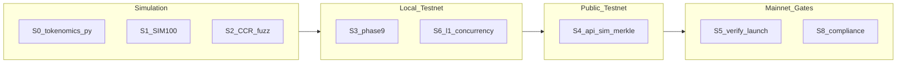

# Simulation → Testnet → Mainnet Traceability

Visual traceability from off-chain simulation through testnet to mainnet gates.

**VIS-N24:** EntropyBus sim `event_hash` chain · Events 21–25 BFT inject ([`abm_architecture.md`](../simulation/abm_architecture.md))

---

## Traceability table

| Stage | Artifact | Command / test | Validates | Testnet step | Mainnet gate |
|-------|----------|----------------|-----------|--------------|--------------|
| **S0** Tokenomics model | `simulators/tokenomics/simulate.py` | `python3 simulators/tokenomics/simulate.py` | Burn / APY projections | N/A (off-chain) | Tokenomics lock sign-off |
| **S1** SIM100 batch | `scripts/sim/run_100_events.sh` | seed 42 | Adversarial third survival | `clarityd sim-block` | GO Gate 2 |
| **S2** CCR fuzz | `tests/fuzz_stress.rs` | `cargo test fuzz_` | Set bounds 1–99 | Local testnet | Phase 1 |
| **S3** Integration | `tests/phase9_integration.rs` | `cargo test phase9` | Indexer + 4 validators | `testnet_manifold` | Phase 9 |
| **S4** API + sim mirror | `clrty-api` | `GET /v1/sim/merkle` vs ATU 10001 | Deterministic Merkle | Public testnet RPC | Gate 2 |
| **S5** Launch verify | `scripts/verify_launch.sh` | full stack | Pre-mainnet checklist | Staging | Gate 3 |
| **S6** L1 concurrency | `scripts/stress/l1_concurrency.sh` | OQ1 events 1–10 | Genesis + sim-block | Validator mesh | Gate 2 |
| **S7** Bridge (deferred) | `ClrtyOFTv2.sol` | `verify_bridge_connection_hashes.sh` | Cap + peer hashes | LZ testnet peers | Phase 10 |
| **S8** Compliance path | `settlement/*` | `cargo test -p clrty-substrate settlement` | KYC + escrow | Gatekeeper dry-run | Gate 4 legal |

---

## Swimlane



---

## VIS-N24 — Events 21–25 (BFT stress inject)

SIM100 events 21–25 run **OQ1 / bft_stress** regime — flat price, ledger holds. Maps to:

| Sim event | Regime | L1 hook |
|-----------|--------|---------|
| E21–25 | Adversarial BFT | `sim-block` + EntropyBus heartbeat |
| Merkle batch | Determinism | `/v1/sim/merkle` = ATU 10001 root |

Cross-check:

```bash
bash scripts/sim/run_100_events.sh
cargo run -p atu_runner -- 10001
curl http://127.0.0.1:8545/v1/sim/merkle
```

---

## Jump criteria (simulation → testnet)

| Criterion | Threshold |
|-----------|-------------|
| SIM100 pass | 100/100 events, merkle match |
| Fuzz pass | 500 transfers, sets ∈ [1,99] |
| Genesis verify | Checksum `df3f767f…` match |
| Phase9 | 4 validators + indexer ingest |

---

## Jump criteria (testnet → mainnet)

| Gate | Checklist |
|------|-----------|
| Gate 1 | Tokenomics locked, genesis verify, substrate audit script |
| Gate 2 | L1 simulation + concurrency stress |
| Gate 3 | Validator set, 48h timelock |
| Gate 4 | Phase 2 legal clearance ([`go_sequence.md`](go_sequence.md)) |

---

## Related

- Launch strategy: [`CLRTY_Live_Market_Notion.md`](../simulation/CLRTY_Live_Market_Notion.md)
- Events catalog: [`events_100_catalog.md`](../simulation/events_100_catalog.md)
- Investor security summary: [`INVESTOR_SECURITY_SUMMARY.md`](../audit/INVESTOR_SECURITY_SUMMARY.md)
