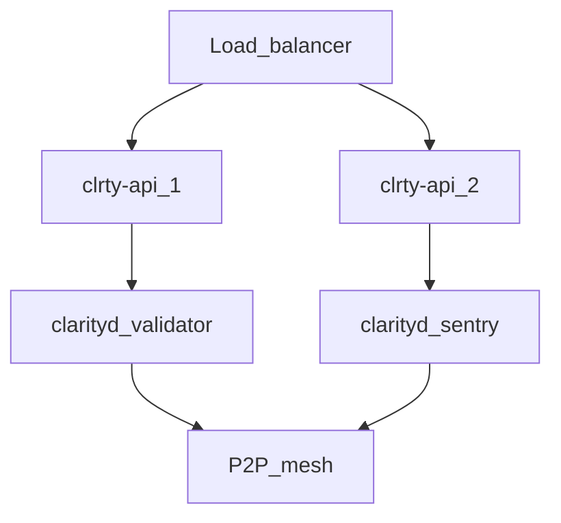

# L1 RPC Provision — CLRTY-1

Provisioning guide for **CLRTY L1** (`clrty-1`) JSON-RPC and REST endpoints.

**Spec:** [clrty-1.md](../chain/clrty-1.md) · **Production ops:** [l1_production_operations.md](l1_production_operations.md)

---

## Network parameters

| Field | Value |
|-------|-------|
| Chain ID | `clrty-1` |
| Numeric chain ID | `1202` |
| Denom | `uclrty` |
| Decimals | 9 |
| Default local RPC | `http://127.0.0.1:8545` |
| Default local WS | `ws://127.0.0.1:8545/ws` |

---

## Environment variables

Copy from `.env.example` to `.env.l1`:

```bash
CLRTY_L1_RPC=http://127.0.0.1:8545
CLRTY_L1_WS=ws://127.0.0.1:8545/ws
CLRTY_L1_CHAIN_ID=clrty-1
CLRTY_L1_NUMERIC_CHAIN_ID=1202
```

Indexer worker reads `CLRTY_L1_RPC`: `CLRTY_SUBSTRATE/data_lake_pipeline/indexer_worker.rs`

---

## Local development

```bash
# Build API
cargo build -p clrty-api --release

# Run API (REST + RPC on :8545)
cargo run -p clrty-api

# Genesis verify
cargo run -p clarity-cli -- node genesis-verify --plain

# Testnet scaffold
bash scripts/bootstrap_testnet.sh
```

---

## Production topology



| Tier | Role | Exposure |
|------|------|----------|
| Public RPC | clrty-api behind CDN/WAF | `rpc.clarity-fintech.com` |
| Clarity Fortress API | Builder funnel | `api.clrty.dev` |
| Validator | clarityd full node | Private VPC |
| Sentry | P2P relay + DDoS shield | Public P2P only |

Sentry detail: [validators-sentry.md](../chain/validators-sentry.md)

---

## RPC methods

| Method | Purpose |
|--------|---------|
| `getHealth` | Node liveness |
| `getSlot` | Current slot / block height |
| `simulateTransaction` | Pre-flight + MLX toxicity |
| `requestAirdrop` | Testnet faucet (non-mainnet) |

REST:

| Route | Purpose |
|-------|---------|
| `GET /v1/status` | Chain heartbeat |
| `GET /v1/indexer/clrty-l1` | Indexer status |
| `GET /v1/labs/walkthrough` | Clarity Fortress funnel |
| `GET /v1/labs/sections` | Section manifest |

---

## HA checklist

- [ ] Minimum 2 clrty-api replicas behind health-checked LB
- [ ] `CLRTY_L1_RPC` secret in vault — rotate on compromise
- [ ] Rate limits: 100 req/s public, burst 500
- [ ] WebSocket sticky sessions for subscription clients
- [ ] 99.9% SLA target; paging on `getHealth` failure > 30s
- [ ] Geo: primary + DR region with genesis hash match

---

## Verification

```bash
curl -s "${CLRTY_L1_RPC:-http://127.0.0.1:8545}/v1/status" | jq .
curl -s "${CLRTY_L1_RPC:-http://127.0.0.1:8545}/rpc" \
  -H 'Content-Type: application/json' \
  -d '{"jsonrpc":"2.0","id":1,"method":"getHealth","params":[]}' | jq .

bash scripts/labs/verify_labs_smoke.sh
bash scripts/predeploy/l1_launch_simulation.sh --quick
```

---

## External blockers

Production P2P, chain DB, and dedicated validator networking — see [EXTERNAL_BLOCKERS.md](../l1_launch/EXTERNAL_BLOCKERS.md).
